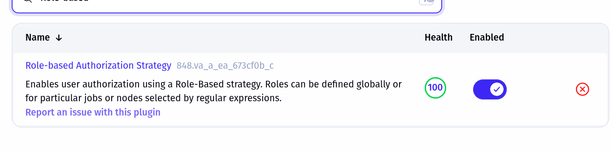

## NOTE 

Master - Slave 
> Requires agent to be run on the slave machines 
`agent.jar` remote.jar -> must run on slave 

- There are two to configure the slave machine 
1. SSH 
2. Download jar and run the file 


- Run pipeline on specific machines 

```bash
ssh-keygen -t rsa -b 4096 -m PEM -f ~/.ssh/jenkins_rsa -N ""
```

### Role-based access control 



"^(devops.*|devops-project/.+)$"